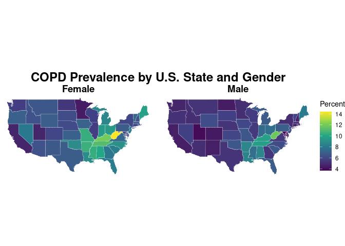
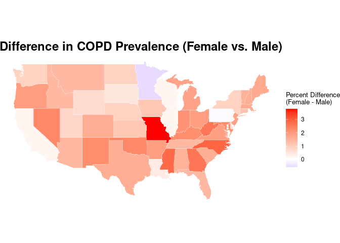
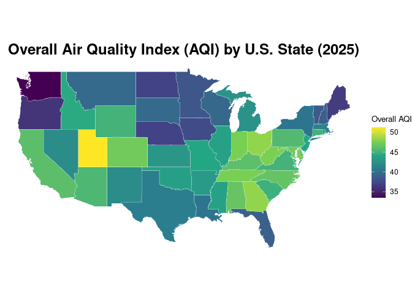

Warm-up mini-Report: Mosquito Blood Hosts in Salt Lake City, Utah
================
Kyle Thomas
2025-11-13

- [ABSTRACT](#abstract)
- [BACKGROUND](#background)
- [STUDY QUESTION and HYPOTHESIS](#study-question-and-hypothesis)
  - [Questions](#questions)
  - [Hypothesis](#hypothesis)
  - [Prediction](#prediction)
- [METHODS](#methods)
  - [Interpretation of Plot](#interpretation-of-plot)
  - [Interpretation of Analysis](#interpretation-of-analysis)
- [CONCLUSION](#conclusion)
- [REFERENCES](#references)

# ABSTRACT

# BACKGROUND

``` r
install.packages(c("tidyverse", "viridis"))
```

# STUDY QUESTION and HYPOTHESIS

## Questions

Do areas of low air quality have higher rates of lung diseases?

## Hypothesis

We expect areas with lower quality air on average will have higher rates
of lung disease and lung related mortality.

## Prediction

# METHODS

``` r
lines <- str_split(data_text, "\n")[[1]]
lines <- trimws(lines)
lines <- lines[lines != ""]
lines <- lines[-1]

# Define the pattern
pattern <- "^([A-Za-z .()0-9]+?)\\s+(\\d+\\.\\d)\\s+([\\d,]+)\\s+(\\d+\\.\\d)\\s+([\\d,]+)\\s+(\\d+\\.\\d)\\s+([\\d,]+)$"
rows <- str_match(lines, pattern)
rows <- rows[!is.na(rows[,1]), ]

# Create the data frame
df <- as.data.frame(rows[,2:8])
colnames(df) <- c("State","Percent_Male","Count_Male","Percent_Female","Count_Female","Percent_Total","Count_Total")
df <- df %>%
  # Filter out rows I don't want to plot
  filter(State != "United States") %>%
  filter(State != "District of Columbia") %>%
  # Convert columns to the right type
  mutate(across(starts_with("Percent"), as.numeric),
         across(starts_with("Count"), ~ as.numeric(str_replace_all(.x, ",", ""))),
         State = str_replace(State, "\\s*\\(.*\\)", ""), # Removes (2020)
         State = str_trim(State))                       # Removes whitespace

# Data check
print("--- Cleaned Data Frame ---")
```

    ## [1] "--- Cleaned Data Frame ---"

``` r
print(head(df))
```

    ##        State Percent_Male Count_Male Percent_Female Count_Female Percent_Total
    ## 1    Alabama          8.6     161900           10.1       207500           9.4
    ## 2     Alaska          5.3      15300            6.1        16100           5.7
    ## 3    Arizona          5.0     137800            6.4       180700           5.7
    ## 4   Arkansas          8.6      97600           10.5       125600           9.6
    ## 5 California          4.5     680600            4.7       733100           4.6
    ## 6   Colorado          4.3      98900            5.9       135100           5.1
    ##   Count_Total
    ## 1      369400
    ## 2       31400
    ## 3      318500
    ## 4      223200
    ## 5     1413800
    ## 6      233900

``` r
# Get map data
states_map <- map_data("state")

# Prepare heat map data to join
heatmap_data <- df %>%
  select(State, Percent_Female, Percent_Male) %>%
  pivot_longer(cols = starts_with("Percent_"),
               names_to = "Group",
               values_to = "Percent") %>%
  mutate(Group = str_replace(Group, "Percent_", ""),
         region = tolower(State)) 

map_plot_data <- left_join(states_map, heatmap_data, by = "region")

# Create the map
map_plot_data %>%
  filter(!is.na(Group)) %>% 
  ggplot(aes(x = long, y = lat, group = group, fill = Percent)) +
  geom_polygon(color = "white", linewidth = 0.1) +
  scale_fill_viridis_c(name = "Percent") +
  facet_wrap(~ Group) + 
  labs(title = "COPD Prevalence by U.S. State and Gender") +
  theme_void() + 
  coord_map() + 
  theme(
    legend.position = "right",
    plot.title = element_text(size = 18, face = "bold", hjust = 0.5),
    strip.text = element_text(size = 14, face = "bold")
  )
```

<!-- -->

``` r
states_map <- map_data("state") 

difference_data <- df %>%
  mutate(
    Percent_Difference = Percent_Female - Percent_Male,
    region = tolower(State)
  ) %>%
  select(region, Percent_Difference)

map_diff_data <- left_join(states_map, difference_data, by = "region")

ggplot(map_diff_data, aes(x = long, y = lat, group = group, fill = Percent_Difference)) +
  geom_polygon(color = "white", linewidth = 0.1) +
  scale_fill_gradient2(
    name = "Percent Difference\n(Female - Male)",
    low = "blue",
    mid = "white",
    high = "red",
    midpoint = 0
  ) +
  labs(title = "Difference in COPD Prevalence (Female vs. Male)") +
  theme_void() +
  coord_map() +
  theme(
    legend.position = "right",
    plot.title = element_text(size = 18, face = "bold", hjust = 0.5),
    legend.title = element_text(size = 10),
    legend.text = element_text(size = 9)
  )
```

<!-- -->
\## Air Quality Index

``` r
aq_df <- read_csv("air-quality-by-state-2025.csv")

print("--- Air Quality Data ---")
```

    ## [1] "--- Air Quality Data ---"

``` r
print(head(aq_df))
```

    ## # A tibble: 6 × 6
    ##   stateFlagCode state         AirQuality_AirQualityInde…¹ AirQualityRankViaUSN…²
    ##   <lgl>         <chr>                               <dbl>                  <dbl>
    ## 1 NA            Utah                                 51.2                     46
    ## 2 NA            Georgia                              48.2                     26
    ## 3 NA            Ohio                                 48.2                     36
    ## 4 NA            West Virginia                        47.6                      6
    ## 5 NA            Indiana                              47.5                     37
    ## 6 NA            Tennessee                            47.5                     28
    ## # ℹ abbreviated names: ¹​AirQuality_AirQualityIndexViaUSA_num_YearFree,
    ## #   ²​AirQualityRankViaUSNews_2024
    ## # ℹ 2 more variables: DaysWithUnhealthyAirQuality_2024 <dbl>,
    ## #   AirQualityIndustrialToxinConcentration_2024 <dbl>

``` r
states_map <- map_data("state")

aq_data_to_plot <- aq_df %>%
  select(State = state, Overall_AQI = `AirQuality_AirQualityIndexViaUSA_num_YearFree`) %>% 
  mutate(region = tolower(State))

map_plot_data <- left_join(states_map, aq_data_to_plot, by = "region")

map_plot_data <- map_plot_data %>%
  filter(!is.na(Overall_AQI))

ggplot(map_plot_data, aes(x = long, y = lat, group = group, fill = Overall_AQI)) +
  geom_polygon(color = "white", linewidth = 0.1) +
  scale_fill_viridis_c(name = "Overall AQI") +
  labs(title = "Overall Air Quality Index (AQI) by U.S. State (2025)") +
  theme_void() +
  coord_map() +
  theme(
    legend.position = "right",
    plot.title = element_text(size = 18, face = "bold", hjust = 0.5),
    legend.title = element_text(size = 10),
    legend.text = element_text(size = 9)
  )
```

<!-- -->
\# DISCUSSION

## Interpretation of Plot

## Interpretation of Analysis

# CONCLUSION

# REFERENCES

1.  
2.  ChatGPT. OpenAI, version Jan 2025. Used as a reference for functions
    such as plot() and to correct syntax errors. Accessed 2025-11-13.
