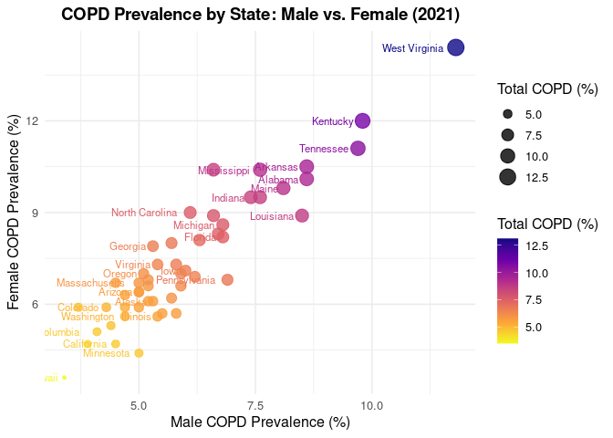

Warm-up mini-Report: Mosquito Blood Hosts in Salt Lake City, Utah
================
Kyle Thomas
2025-10-29

- [ABSTRACT](#abstract)
- [BACKGROUND](#background)
- [STUDY QUESTION and HYPOTHESIS](#study-question-and-hypothesis)
  - [Questions](#questions)
  - [Hypothesis](#hypothesis)
  - [Prediction](#prediction)
- [METHODS](#methods)
- [DISCUSSION](#discussion)
  - [Interpretation of Plot](#interpretation-of-plot)
  - [Interpretation of Analysis](#interpretation-of-analysis)
- [CONCLUSION](#conclusion)
- [REFERENCES](#references)

# ABSTRACT

# BACKGROUND

``` r
install.packages(c("tidyverse", "viridis"))
```

    ## Installing packages into '/cloud/lib/x86_64-pc-linux-gnu-library/4.5'
    ## (as 'lib' is unspecified)

# STUDY QUESTION and HYPOTHESIS

## Questions

Do areas of low air quality have higher rates of lung diseases?

## Hypothesis

We expect areas with lower quality air on average will have higher rates
of lung disease and lung related mortality.

## Prediction

# METHODS

``` r
# Load packages
library(tidyverse)
```

    ## ── Attaching core tidyverse packages ──────────────────────── tidyverse 2.0.0 ──
    ## ✔ dplyr     1.1.4     ✔ readr     2.1.5
    ## ✔ forcats   1.0.1     ✔ stringr   1.5.2
    ## ✔ ggplot2   4.0.0     ✔ tibble    3.3.0
    ## ✔ lubridate 1.9.4     ✔ tidyr     1.3.1
    ## ✔ purrr     1.1.0     
    ## ── Conflicts ────────────────────────────────────────── tidyverse_conflicts() ──
    ## ✖ dplyr::filter() masks stats::filter()
    ## ✖ dplyr::lag()    masks stats::lag()
    ## ℹ Use the conflicted package (<http://conflicted.r-lib.org/>) to force all conflicts to become errors

``` r
# Read data
copd <- read.csv(text = "
State,Male_Percent,Male_Count,Female_Percent,Female_Count,Total_Percent,Total_Count
Alabama,8.6,161900,10.1,207500,9.4,369400
Alaska,5.3,15300,6.1,16100,5.7,31400
Arizona,5.0,137800,6.4,180700,5.7,318500
Arkansas,8.6,97600,10.5,125600,9.6,223200
California,4.5,680600,4.7,733100,4.6,1413800
Colorado,4.3,98900,5.9,135100,5.1,233900
Connecticut,4.7,65400,5.9,87200,5.3,152500
Delaware,5.9,22400,6.6,27300,6.2,49700
District of Columbia,4.1,10600,5.1,15100,4.6,25700
Florida,6.8,574600,8.2,745500,7.5,1320100
Georgia,5.3,211000,7.9,341100,6.6,552100
Hawaii,3.4,19300,3.6,20800,3.5,40200
Idaho,5.0,35400,6.4,45800,5.7,81200
Illinois,5.4,260600,5.6,287300,5.5,547900
Indiana,7.4,188300,9.5,256200,8.5,444400
Iowa,6.0,72500,7.1,89000,6.6,161600
Kansas,5.9,64400,7.0,79300,6.4,143700
Kentucky,9.8,166800,12.0,214900,10.9,381700
Louisiana,8.5,144500,8.9,163700,8.7,308200
Maine,8.1,43600,9.8,56200,9.0,99900
Maryland,3.7,85000,5.9,149000,4.8,234000
Massachusetts,5.0,136300,6.7,196200,5.9,332500
Michigan,6.8,261800,8.6,348500,7.7,610200
Minnesota,5.0,108600,4.4,98700,4.7,207400
Mississippi,7.6,82500,10.4,122400,9.1,204900
Missouri,6.6,153500,10.4,255600,8.5,409000
Montana,5.2,22800,6.6,28400,5.9,51200
Nebraska,5.2,38300,6.1,45600,5.6,83900
Nevada,5.7,69200,8.0,98600,6.8,167800
New Hampshire,4.7,165200,6.3,235000,5.5,400100
New Jersey,6.3,35100,8.1,46400,7.2,81400
New Mexico,4.5,36100,6.7,55900,5.6,91900
New York,5.0,379600,5.9,490200,5.5,869900
North Carolina,6.1,241000,9.0,386500,7.6,627500
North Dakota,4.4,13500,5.3,15600,4.8,29100
Ohio,7.6,340300,9.5,452900,8.6,793200
Oklahoma,6.6,98500,8.9,136800,7.8,235300
Oregon,5.1,85200,7.0,120300,6.1,205500
Pennsylvania,6.9,344000,6.8,361300,6.8,705300
Rhode Island,5.8,24600,5.7,26000,5.7,50600
South Carolina,6.7,130600,8.3,177200,7.5,307800
South Dakota,5.7,19300,6.2,20800,6.0,40100
Tennessee,9.7,254600,11.1,311100,10.4,565700
Texas,5.2,570900,6.8,771100,6.0,1342000
Utah,3.9,46500,4.7,56300,4.3,102800
Vermont,5.8,15000,7.3,19700,6.6,34700
Virginia,5.4,179600,7.3,254500,6.4,434100
Washington,4.7,143400,5.6,172300,5.1,315700
West Virginia,11.8,82300,14.4,103900,13.1,186200
Wisconsin,5.5,126400,5.7,132800,5.6,259200
Wyoming,6.2,14100,6.9,15100,6.5,29200
United States,5.5,6800400,6.8,8875100,6.2,15587000
")

# Inspect the data
head(copd)
```

    ##        State Male_Percent Male_Count Female_Percent Female_Count Total_Percent
    ## 1    Alabama          8.6     161900           10.1       207500           9.4
    ## 2     Alaska          5.3      15300            6.1        16100           5.7
    ## 3    Arizona          5.0     137800            6.4       180700           5.7
    ## 4   Arkansas          8.6      97600           10.5       125600           9.6
    ## 5 California          4.5     680600            4.7       733100           4.6
    ## 6   Colorado          4.3      98900            5.9       135100           5.1
    ##   Total_Count
    ## 1      369400
    ## 2       31400
    ## 3      318500
    ## 4      223200
    ## 5     1413800
    ## 6      233900

``` r
str(copd)
```

    ## 'data.frame':    52 obs. of  7 variables:
    ##  $ State         : chr  "Alabama" "Alaska" "Arizona" "Arkansas" ...
    ##  $ Male_Percent  : num  8.6 5.3 5 8.6 4.5 4.3 4.7 5.9 4.1 6.8 ...
    ##  $ Male_Count    : int  161900 15300 137800 97600 680600 98900 65400 22400 10600 574600 ...
    ##  $ Female_Percent: num  10.1 6.1 6.4 10.5 4.7 5.9 5.9 6.6 5.1 8.2 ...
    ##  $ Female_Count  : int  207500 16100 180700 125600 733100 135100 87200 27300 15100 745500 ...
    ##  $ Total_Percent : num  9.4 5.7 5.7 9.6 4.6 5.1 5.3 6.2 4.6 7.5 ...
    ##  $ Total_Count   : int  369400 31400 318500 223200 1413800 233900 152500 49700 25700 1320100 ...

``` r
# Remove the national total
copd <- copd %>% filter(State != "United States")

# Create scatterplot: Female vs. Male COPD prevalence
ggplot(copd, aes(x = Male_Percent, y = Female_Percent, 
                 size = Total_Percent, color = Total_Percent, label = State)) +
  geom_point(alpha = 0.8) +
  geom_text(aes(label = State), hjust = 1.2, vjust = 0.5, size = 3, check_overlap = TRUE) +
  scale_color_viridis_c(name = "Total COPD (%)", option = "C", direction = -1) +
  scale_size_continuous(name = "Total COPD (%)") +
  labs(
    title = "COPD Prevalence by State: Male vs. Female (2021)",
    x = "Male COPD Prevalence (%)",
    y = "Female COPD Prevalence (%)"
  ) +
  theme_minimal(base_size = 12) +
  theme(
    plot.title = element_text(size = 14, face = "bold", hjust = 0.5),
    legend.position = "right"
  )
```

<!-- -->

# DISCUSSION

## Interpretation of Plot

## Interpretation of Analysis

# CONCLUSION

# REFERENCES

1.  Komar N, Langevin S, Hinten S, Nemeth N, Edwards E, Hettler D, Davis
    B, Bowen R, Bunning M. Experimental infection of North American
    birds with the New York 1999 strain of West Nile virus. Emerg Infect
    Dis. 2003 Mar;9(3):311-22. <https://doi.org/10.3201/eid0903.020628>

2.  ChatGPT. OpenAI, version Jan 2025. Used as a reference for functions
    such as plot() and to correct syntax errors. Accessed 2025-10-29.
